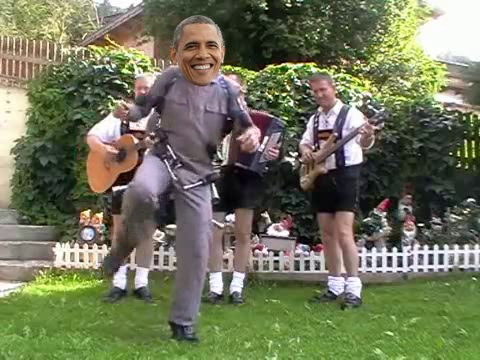

# Stupid face replacer

This puts a face in a video, over an existing face. Like this:

It will detect the face that you want, and paste a transparent PNG (which also contains a face) over the top. It will
*not* try and make it look realistic or anything clever like that.

There are some variables at the top of `face_replace.py` that can be tweaked.

There are some dependencies in `requirements.txt`. I used Python 3.
